# Project Raycity
 ### 기존의 "레이시티" 게임의 엘리트 미션 컨텐츠를 언리얼 엔진을 이용해 간단하게 만든 포트폴리오용 게임.
    스킬을 적절히 사용해 SP를 관리하며 스릴 효과를 발생시켜 만족도를 올리자!
- 개발 규모 : 1인
- 버전 : Unreal Engine 5.2.1
- 사용한 프로그램 : BluePrint만 사용

# 시연 영상
 TODO

# 개발 범위
## 플레이어블 캐릭터
### 스킬 및 이동 구현
|이름|사용 SP|키|
|------|---:|---:|
|기본 이동||← ↑ ↓ →|
|드리프트|10|LShift|
|부스터|50|LCtrl|
|칼치기|8|z, x|
|점프|10|Space|
|급출발|10|↑↑|
|급정거|10|↓↓|

    기본 이동은 Chaos Vehicle Movement를 사용함

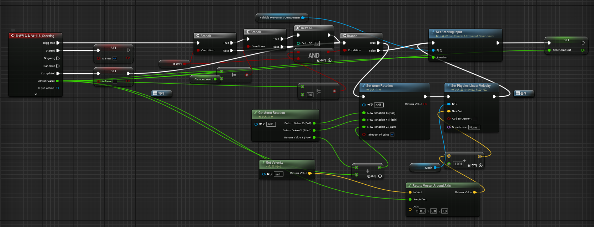

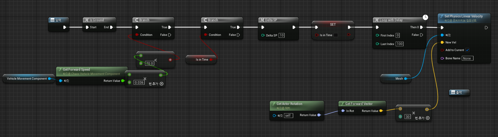

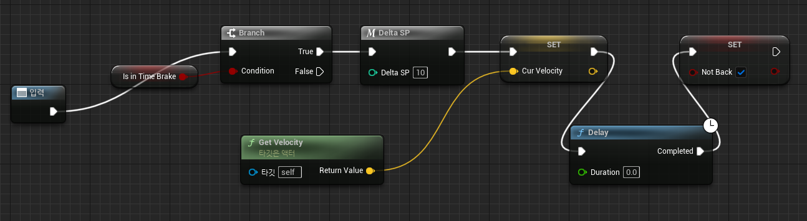

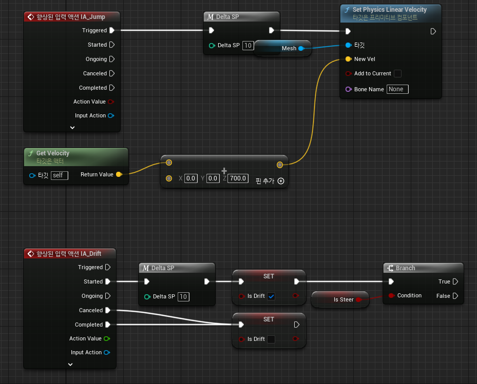

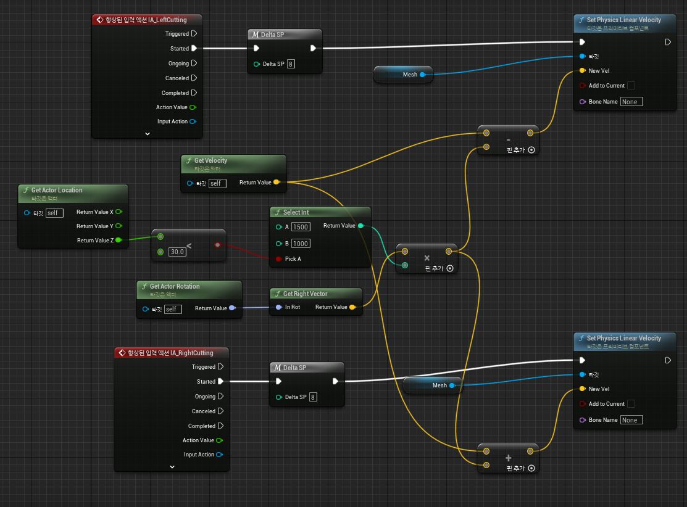

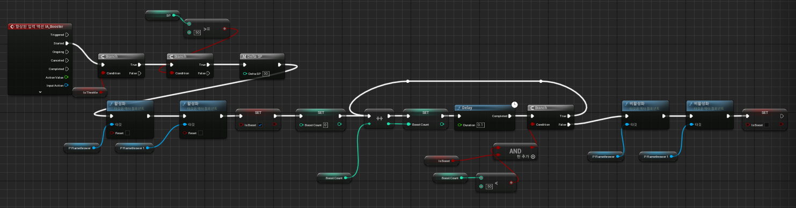

### 스릴 및 만족도 구현
 - 플레이어가 AI 차를 가까이 지나갈 때 $(|\triangle속도|)/(둘 사이의 거리)$가 일정 이상이 될 때 스릴 효과가 발생
 - 스릴 효과가 발생하면 만족도가 300만큼 차고 부스터를 사용중에 SP가 10 증가하고 그렇지 않을 때 SP가 20 증가함

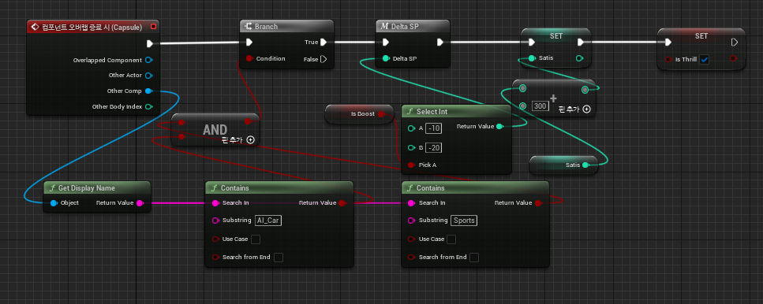

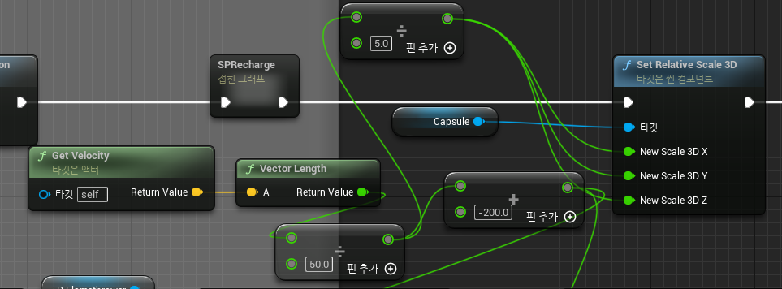

### 네비게이션 구현
 - 도로의 spline을 불러와서 변수에 저장함
 - 랜덤으로 도착지를 설정한 후에 현재 위치에서부터 도착지까지의 최단 경로를 BFS와 백트래킹으로 찾고 경로중 가장 가까운 spline을 따라가도록 화살표의 방향을 정함
 - 플레이어가 목적지에 다다르면 목적지 위치를 찍어주고 위의 내용을 반복함

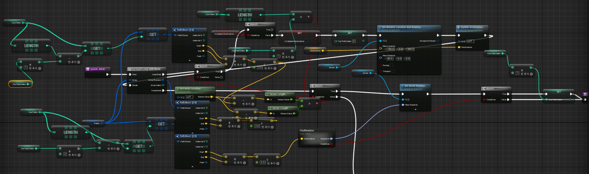

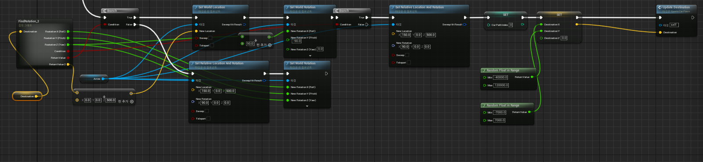

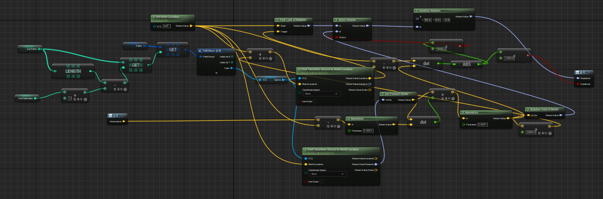

## AI 
### 경로 찾기
 - 현재 위치에서 가장 가까운 spline을 따라감  

        차의 현재 속도와 steer 값을 받아 진행 경로를 예측하고 가고자 하는 spline에 맞춰 속도와 steer를 적절히 조절함
 - 랜덤으로 다음 교차로에서 직진, 좌회전, 우회전 여부를 결정함
 - 결정된 상태를 통해 spline 중간에서 차선변경을 함
 - spline의 끝 즉 교차로에 다다르면 처음부터 반복함

        모든 이동은 Chaos Vehicle Movement을 기반으로 함

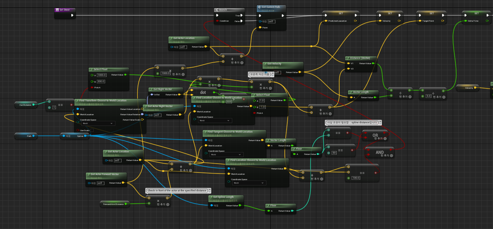

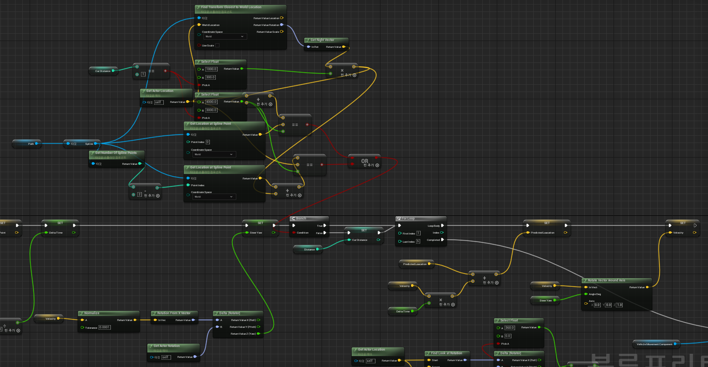

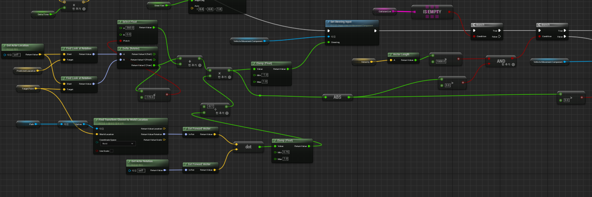

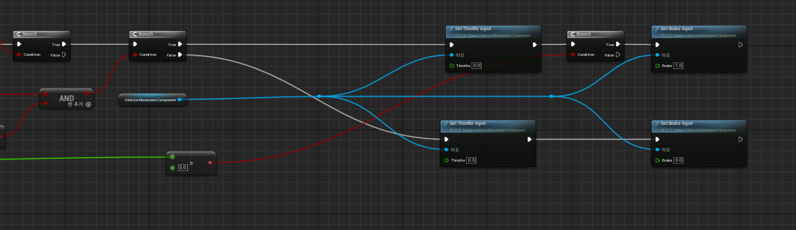

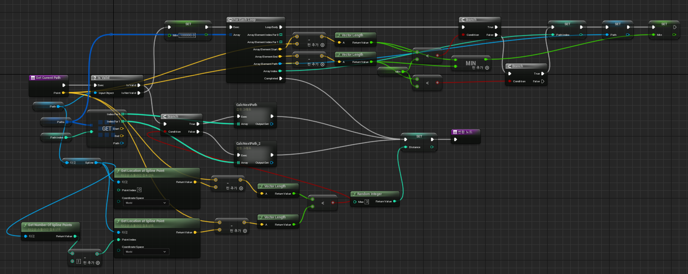

### 충돌 방지
 - AI차 앞에 Collision Box를 설정해 Collision Box에 물체가 감지되면 브레이크를 밟음
 - 만약 CollisionBox끼리 충돌했다면 오른쪽에 있는 차가 먼저 지나감 (Deadlock 방지)
 - 이를 이용해 신호등을 적신호일 때 해당 도로에 Collision Box를 설치하는 것으로 구현함

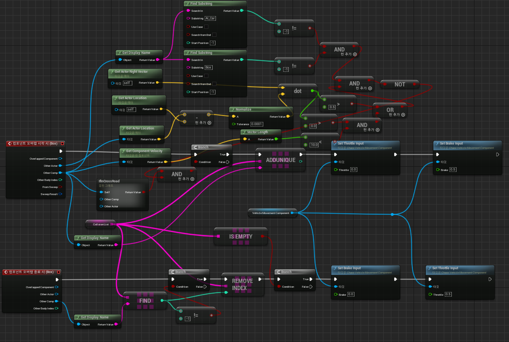
 
## 개선사항
블루프린트 특성상 Tick Event에 상당한 부하가 걸리는데 AI와 네비게이션 기능이 상당한 딜레이를 잡아먹어서 이를 C++로 구현하여 개선해야함.
